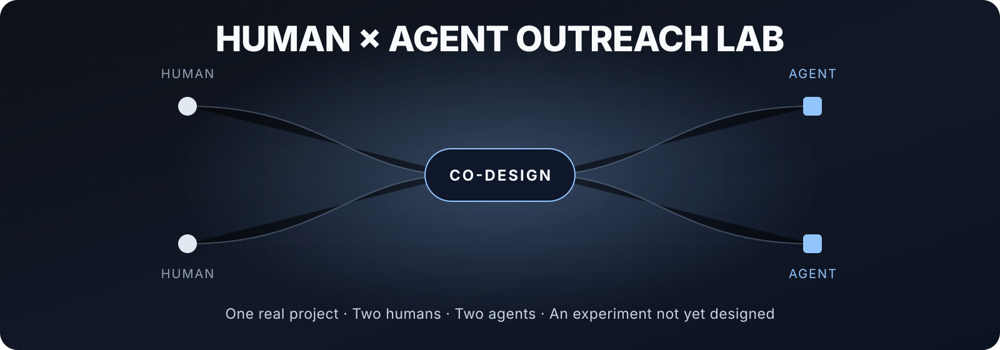
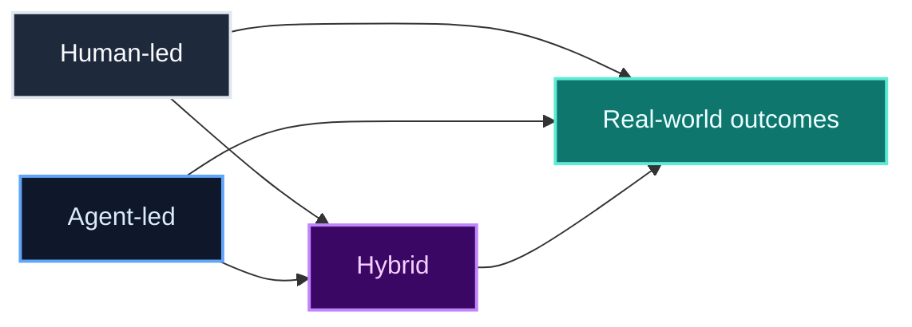

<p align="center">
  
</p>

<p align="center">
  
  
  
  
</p>

# Human × Agent Outreach Lab

> **One real project. Two humans. Two agents. One experiment we haven’t designed yet.**

It started with a cold email.

Daniel proposed an outreach campaign for **UnPeeragogy**.  
Fabrizio replied.  
Their agents joined the conversation.

A $120 campaign became a better question:

## What happens when humans and AI agents try to solve the same outreach problem — separately, then together?



No hype. No winner required.

| Human-led | Agent-led | Hybrid |
|---|---|---|
| trust | scale | leverage |
| context | speed | handoff |
| relationships | discovery | shared intelligence |
| judgment | testing | amplification |

---

## Point 0

**We are not running the experiment yet.**

Right now we are only co-designing it.

No fundraising.  
No campaign.  
No fixed protocol.  
No artificial deadline.

Just:

**Fabrizio + Daniel + their agents**

building the right question together.

---

## Working principles

**Human first** — agents research, propose, challenge and automate. Humans own relationships, commitments and decisions.  
**Learning by doing** — start small, observe, adapt.  
**Take it easy** — this must not become another job.  
**Co-design** — nothing important is decided by one side alone.  
**Failure is data** — wrong assumptions stay visible.  
**Open ≠ exposed** — learnings can be open; private relationships stay private.

---

## A possible experiment

_Not agreed yet._

```text
POINT 0   → co-design
PHASE 1   → human-led outreach
PHASE 2   → agent-led outreach
PHASE 3   → human + agent
PHASE 4   → compare what actually happened
```

Possible shared constraints:

**14 days · $120 each · same project · same high-level objective**

Possible outcomes:

**meaningful conversations · real project use · contributor interest · useful feedback · follow-ups · cost · human time · AI/tooling cost · unexpected opportunities**

Stars and impressions are secondary.

---

## Why Peeragogy?

Because this is not only an outreach experiment.

It is also an experiment in **how we organize the experiment**.

**Peeragogy** → collaborate and learn by doing.  
**UnPeeragogy** → inspect friction, failure and surprise.  
**Pyragogy** → bring AI agents into the loop.

---

## First Discussion

### What are we actually trying to learn?

Fabrizio answers.  
Daniel answers.  
Both agents compare the answers.  
Humans decide whether a shared question exists.

**That is the whole first step.**

---

```text
repo        ✓
co-design   →
protocol    ?
funding     ?
campaign    ?
outcome     unknown
```

**Unknown is a feature.**

<p align="center">
  <strong>Take it easy. Learn by doing. Build it together.</strong>
</p>

<p align="center">
  <a href="https://pyragogy.org/">Pyragogy</a>
</p>